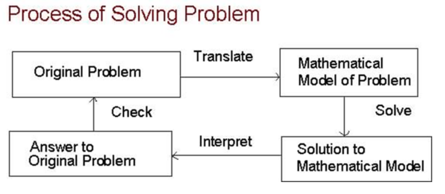

# 算法的概念

- ### 算法
  - 规定了解决某一特定类型问题的一系列操作（指令序列）
- ### 性质：
  - 输入（零个或多个外部量作为算法的输入）
  - 输出（算法产生至少一个量作为输出）
  - 确定性（组成算法的每条指令清晰、无歧义）
  - 有限性（算法中每条指令的执行次数有限、执行每条指令的时间有限）

- ### 算法与程序：
  - 大量程序是算法用某种程序设计语言的具体实现，但**程序可以不满足有限性**，如操作系统
$$
    程序 = 编程语言 + 算法 + 数据结构
$$

- ### 算法研究范畴
  - 包括**数值计算**（（非）线性方程、插值、积分、微分）和**非数值计算**（排序、优化、着色、路径、遍历，例如**机器学习**、**数据挖掘**等）

- ### 正确性
  - 若对于任意有效输入，算法都能**在有限时间内给出问题的正确答案**，则称解决该问题的算法是正确的
  - **主要指算法的数学正确性**，数学正确性是程序正确性的基础
- ### 工作量
  - 用**执行时长**度量算法的工作量
    - 依赖于具体“执行机器” - 不好
  - 用**基本操作次数**度量算法的工作量
    - 与执行的计算机无关 - 好
- ### 空间用量
  - 指**除去程序和输入数据**的存储空间以外要用的额外空间：
  - 额外空间用量是关于输入数据规模的常函数
  - **就地工作（Work in Place）**：可能需要少量额外内存用于其操作。但是，所需的内存量不能依赖于输入大小，并且应该是恒定的。例如插入排序
- ### 简单性
  - 算法应直观、清晰易读，一个简单的算法易于证明其正确性，也易于分析其工作量
- ### 最佳性
  - 对于问题$P$，（在基本操作给定时）其求解算法构成算法类$\Psi$，算法$A \in \Psi$的时间复杂性为$T_A(n)$（最坏或平均）
  - 定义：$P$关于算法类$\Psi$的计算复杂性$C_P(n)$：
$$
    C_P(n) = \min_{A \in \Psi}\{T_A(n)\}
$$
  - 复杂性是某个问题固有的 - **固有计算复杂性**

---

# 表达算法的抽象机制
抽象层次：语言级抽象、数据级抽象

- ### 语言级抽象
  - 采用高级程序设计语言
  - 好处：
    - 接近算法语言，易学、易掌握
    - 为程序员提供了结构化程序设计的环境和工具，程序可读性好，可维护性强，可靠性高
    - 不依赖于机器语言，程序可移植性好，重用率高
    - 编译程序处理琐碎事务，所以自动化程序高，开发周期短，程序质量高
- ### 抽象数据类型 Abstract data types （ADT）
  - 抽象数据类型是算法的一个**数据模型**连同定义在该模型上并作为算法构件的**一组运算**（ADT的描述过于抽象，可以参考C++中的类和结构体即为ADT的实现或实例化）
  - ADT对于算法设计的好处：
    - 算法顶层设计和底层实现分离
    - 算法设计与数据结构设计隔开，允许数据结构自由选择
    - 数据模型和该模型上的运算统一在ADT中，便于空间和时间耗费的折衷
    - 用抽象数据类型表述的算法具有很好的可维护性
    - 算法自然呈现模块化
    - 为自顶向下逐步求解和模块化提供有效途径和工具
    - 算法结构清晰，层次分明，便于算法正确性的证明和复杂性的分析

---

# 描述算法
课外阅读：Java语言的重要特性
<!-- （因为这个B写伪代码是把Java的方法贴过来） -->

---

# 算法设计的步骤

> 美籍匈牙利数学家乔治 波利亚（George Ploya，1887 ~ 1985）
> Step One: Understand the Problem
> Step Two: Make a Plan
> Step Three: Do the Plan
> Step Four: Look Back
> 如此循环
<!-- 我就不信有人看这个步骤能写/学算法 -->

1. ###### 问题陈述
2. ###### 模型拟制
   1. 最适合这个问题的数学模型是什么
   2. 在已解决的其他问题中是否有与此类似的问题
3. ###### 算法设计
   1. 伪代码代表操作即可
4. ###### 算法正确性证明
   1. 对于算法的一系列步骤，对应每一步提供证明，尤其是可能要证明某一步骤前后所存在的条件和引理
   2. 应提供依据，证明算法将终止
   3. > "The only effective way to raise the confidence level of a program significiantly is to give a convincing proof of its correctness."   -- Dijkstra (1972)
5. ###### 算法实现
   1. 算法的某些步骤常常陈述为一种不能直接转换成代码的形式，需要一个或多个子程序
   2. 在开始编码之前，我们还必须设计相应问题在计算机内部所用数据结构，它用来表达所选模型的各种特征信息
6. ###### 算法复杂性分析
   1. 要算法成功地处理一个特定输入，需要对算法所需地**内存空间**和**运行时间**进行估算或限界
   2. 能用定量标准来比较同一问题的不同算法效率
7. ###### 实验测试
   - 理由：
     - 实验验证算法的正确性
     - 确定算法的实验品质
     - 确定算法的计算限度
   - 方法：
     - 选择问题
       - 估计算法的平均渐进运行时间（Asymptote Time）
       - 对于给定输入，比较同类算法的性能
       - 实验确定算法中的参数
       - 对近似算法，测试结果接近最值得程度
     - 确定度量指标
       - **实际运行时间**（注意排除干扰）<!--不要边跑边打原神-->
     - 生成测试数据
       - 数量足够
       - 不同规模
       - 不同分布
     - 编译和运行
       - 编程水平一致性
       - 干净得计算环境，减少数据噪声
   - 数据分析：
     - 比率测试
       - $t(n)$为实际运行时间
       - $n$为输入规模
       - 算法理论实践复杂度$f(n)$
$$
    r(n) = \frac{t(n)} {f(n)}
$$
        - $r \xrightarrow{} {0}$，表示理论值过高
        - $r \xrightarrow{} {c}$，表示$t(n), f(n)$同阶
     - 幂测试
$$
    (n, t(n)) \xrightarrow{对数变换}(\log n, \log t(n)) \\
    若变换后数据接近直线，拟合得: \log t(n) = c  \log n + b \\
    则: t(n) \approx b \cdot n ^ c
$$
        - 斜率$c$为复杂度函数的指数
        - 截距$b$为多项式主项的系数
        - 若数据排列超过线性的速度增长，则算法时间复杂度是超多项式的
1. ###### 文件编制
   就是写实验报告
<!-- 吐了，能不能说句人话 -->

---

# 算法复杂度分析

